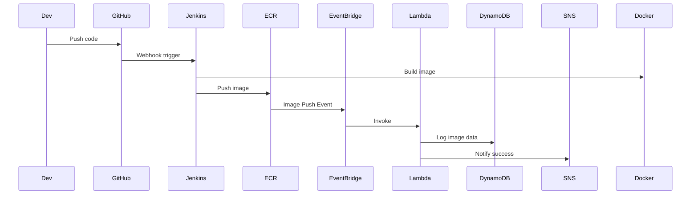
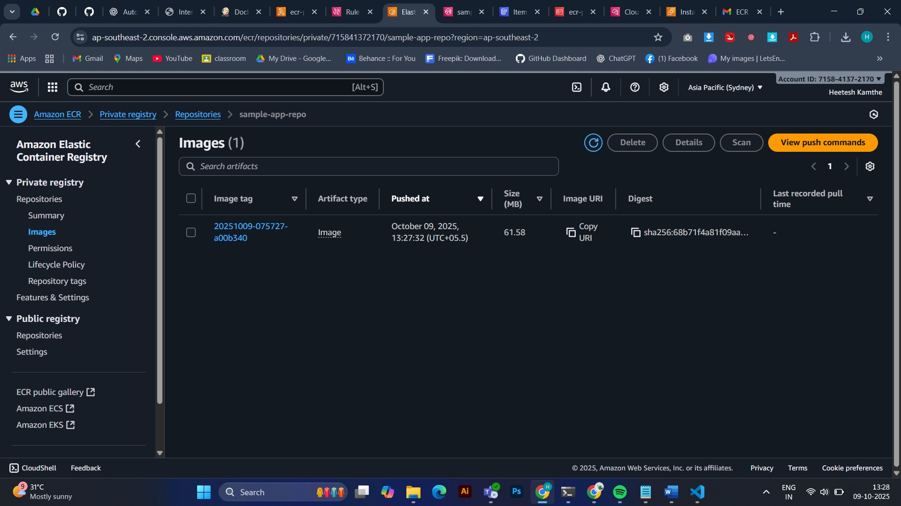
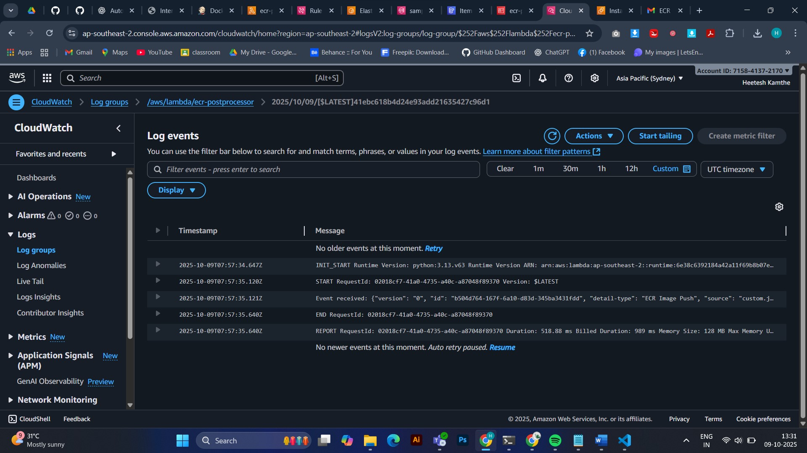
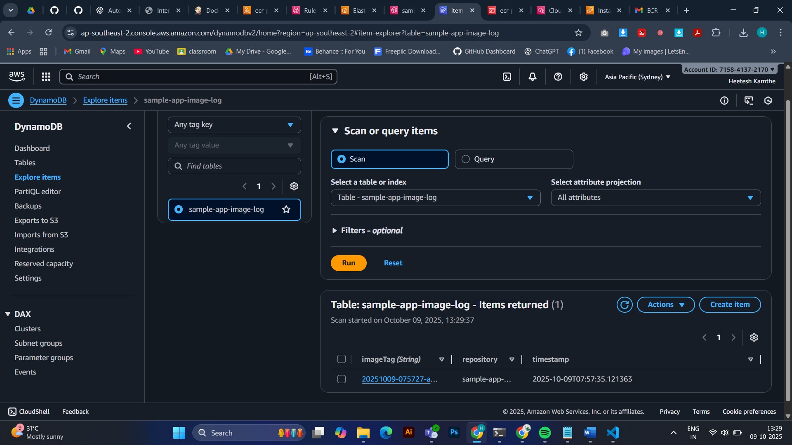

# 🚀 Automated Docker Image Deployment to Amazon ECR with Jenkins and Lambda Integration

## 🧩 Overview
This project demonstrates a complete **CI/CD pipeline** for Dockerized applications using **Jenkins**, **Amazon ECR**, **EventBridge**, **Lambda**, **DynamoDB**, and **SNS**.

You can set it up in two ways:
- **Manual Setup (No Terraform / No CLI)**
- **Automated Setup using Terraform**

---


## 🎯 Objective
Automate the workflow where every code push:

- 🏗️ Builds a Docker image in Jenkins
  
- 📦 Pushes it to Amazon ECR
  
- ⚡ Triggers AWS Lambda via EventBridge
   
- 🗃️ Logs image details in DynamoDB
  
- 📧 Sends notifications through SNS
  

---

## 🧱 Architecture Diagram


---


# 🧩 PART 1: Manual AWS Setup (No Terraform)


### 🧠 Flow Summary

| Step | Action | Description |
|------|---------|-------------|
| 1️⃣ | Create ECR repository | Store Docker images |
| 2️⃣ | Prepare application code | Node.js + Dockerfile |
| 3️⃣ | Configure Jenkins | Build & push Docker image |
| 4️⃣ | Create Lambda function | Log and notify |
| 5️⃣ | Create DynamoDB + SNS | Store & send notifications |
| 6️⃣ | Create EventBridge rule | Trigger Lambda on push |
| 7️⃣ | Trigger & verify | Confirm CI/CD flow |
---
### 1️⃣ Go to AWS Console → ECR → Create repository

  1. Name: `sample-app-repo`

  2. Tag mutability: `Mutable`

  3. Enable scan on push (optional)

  4. Copy repository URI
     </br>
     
  👉 Example:
  `
  123456789012.dkr.ecr.ap-south-1.amazonaws.com/sample-app-repo
  `

---

### 2️⃣ Prepare Application Code

#### Folder Structure:
```pgsql
auto-ecr-jenkins/
├─ app/
│  ├─ Dockerfile
│  ├─ package.json
│  └─ index.js
└─ jenkins/
   └─ Jenkinsfile
```

#### app/index.js

```js
const express = require('express');
const app = express();
const port = process.env.PORT || 3000;
app.get('/', (req, res) => res.json({ message: 'Hello from Dockerized app!' }));
app.listen(port, () => console.log(`Running on port ${port}`));
```


#### app/package.json

```json
{
  "name": "sample-app",
  "version": "1.0.0",
  "main": "index.js",
  "scripts": { "start": "node index.js" },
  "dependencies": { "express": "^4.18.2" }
}
```

#### app/Dockerfile

```Dockerfile
FROM node:18-alpine
WORKDIR /usr/src/app
COPY package*.json ./
RUN npm ci --only=production
COPY . .
EXPOSE 3000
CMD ["node", "index.js"]
```

---


### 3️⃣ Configure Jenkins


### 🔹 Install Plugins

  - Docker plugin

  - Pipeline plugin

  - GitHub integration

  - Amazon ECR plugin (optional)


### 🔹 Add Credentials

  - Type: Username with password

  - ID: `aws-creds-id`

  - Username:<YOUR AWS_ACCESS_KEY_ID>

  - Password:<YOUR AWS_SECRET_ACCESS_KEY>


### 🔹 Jenkinsfile

##### jenkins/Jenkinsfile

```groovy
pipeline {
  agent any

  environment {
    AWS_REGION = 'ap-south-1'
    AWS_ACCOUNT = '123456789012'
    ECR_REPO_NAME = 'sample-app-repo'
    ECR_URL = "${AWS_ACCOUNT}.dkr.ecr.${AWS_REGION}.amazonaws.com/${ECR_REPO_NAME}"
  }

  stages {
    stage('Checkout') {
      steps {
        checkout scm
        script {
          env.IMAGE_TAG = new Date().format("yyyyMMdd-HHmmss") + "-" + sh(script: "git rev-parse --short HEAD", returnStdout: true).trim()
        }
      }
    }

    stage('Build Docker Image') {
      steps {
        dir('app') {
          sh "docker build -t ${ECR_REPO_NAME}:${IMAGE_TAG} ."
        }
      }
    }

    stage('Login to ECR & Push') {
      steps {
        withCredentials([usernamePassword(credentialsId: 'aws-creds-id', usernameVariable: 'AWS_ID', passwordVariable: 'AWS_SECRET')]) {
          sh '''
            export AWS_ACCESS_KEY_ID=$AWS_ID
            export AWS_SECRET_ACCESS_KEY=$AWS_SECRET
            aws ecr get-login-password --region ${AWS_REGION} | docker login --username AWS --password-stdin ${AWS_ACCOUNT}.dkr.ecr.${AWS_REGION}.amazonaws.com
            docker tag ${ECR_REPO_NAME}:${IMAGE_TAG} ${ECR_URL}:${IMAGE_TAG}
            docker push ${ECR_URL}:${IMAGE_TAG}
            aws events put-events --entries "[{\\"Source\\":\\"custom.jenkins\\",\\"DetailType\\":\\"ECR Image Push\\",\\"Detail\\":\\"{\\\\\\"repository\\\\\\": \\\\\\"${ECR_REPO_NAME}\\\\\\", \\\\\\"imageTag\\\\\\": \\\\\\"${IMAGE_TAG}\\\\\\"}\\"}]"
          '''
        }
      }
    }
  }

  post {
    success {
      echo " Docker image pushed to ECR: ${ECR_URL}:${IMAGE_TAG}"
    }
    failure {
      echo " Build failed"
    }
  }
}
```
---

### 🔁 Configure GitHub Webhook

To ensure Jenkins automatically triggers a new build whenever you push code to GitHub, set up a GitHub Webhook as follows:

1️) Open your GitHub Repository

  Go to ⚙️ Settings → Webhooks → Add Webhook


2️) Enter Webhook Details:

  - Payload URL:

    ```bash 
    http://<your-jenkins-server>:8080/github-webhook/
    ```
  (Replace `<your-jenkins-server>` with your actual Jenkins server public IP or domain.)

  - Content type: `application/json`

  - Events: Select “Just the push event.”

  - Click “Add Webhook.”

#### Once configured, every time you push new code to GitHub:

  - The webhook triggers Jenkins

  - Jenkins builds and pushes a new Docker image to ECR

  - EventBridge detects the push and invokes Lambda

  - Lambda logs data to DynamoDB and sends notifications via SNS

---

### 4️⃣ Lambda Function

- Runtime: Python 3.10
  
- Name: `ecr-postprocessor`

#### lambda/ecr_postprocessor.py

```python
import json, os, boto3
from datetime import datetime

ddb = boto3.client('dynamodb')
sns = boto3.client('sns')

def lambda_handler(event, context):
    detail = event.get('detail', {})
    repo = detail.get('repository', 'unknown')
    tag = detail.get('imageTag', 'unknown')
    ts = datetime.utcnow().isoformat()

    ddb.put_item(
        TableName=os.environ['DDB_TABLE'],
        Item={
            'imageTag': {'S': tag},
            'repository': {'S': repo},
            'timestamp': {'S': ts}
        }
    )

    sns.publish(
        TopicArn=os.environ['SNS_ARN'],
        Message=f"Image pushed: {repo}:{tag} at {ts}",
        Subject="ECR Image Push Notification"
    )
    return {'status': 'ok'}
```

#### Environment Variables:

- DDB_TABLE = `sample-app-image-log`

- SNS_ARN = `arn:aws:sns:ap-south-1:123456789012:sample-app-topic`

### 5️⃣ DynamoDB & SNS

- DynamoDB Table:

    + Name: `sample-app-image-log`

    + Partition key: `imageTag (String)`

- SNS Topic:

    + Name: `sample-app-topic`

    + Create email subscription and confirm via inbox

### 6️⃣ EventBridge Rule

---

  + Event Pattern:
```json
{
  "source": ["custom.jenkins"],
  "detail-type": ["ECR Image Push"]
}
```

  + Target → your Lambda function (`ecr-postprocessor`)

---

### 7️⃣ Verify Flow


✅ Push code to GitHub </br>
✅ Jenkins builds & pushes image → ECR</br>
✅ Jenkins triggers EventBridge → Lambda</br>
✅ Lambda logs record → DynamoDB</br>
✅ SNS sends email → success 🎉</br>

---
## Screenshots

 🖼️ Jenkins Configuration
 <p align="center">  </p>


🖼️ Jenkins Build Success
 <p align="center">  </p>


🖼️ ECR Image Uploaded
 <p align="center">  </p>
 

🖼️ Lambda Invocation Log
 <p align="center">  </p>


🖼️ SNS Email Notification
 <p align="center">  </p>


 🖼️ DynamoDB Table Log
 <p align="center">  </p>

 
---

## 🧩 PART 2: Terraform Setup (Infrastructure as Code)
### 📁 Folder Structure

```css
terraform/
├─ main.tf
├─ variables.tf
├─ outputs.tf
└─ lambda/
   └─ ecr_postprocessor.py
```

---

### ⚙️ main.tf
```hcl
provider "aws" {
  region = var.region
}

# 1️ ECR Repository
resource "aws_ecr_repository" "sample_repo" {
  name = var.ecr_repo_name
  image_tag_mutability = "MUTABLE"
  image_scanning_configuration {
    scan_on_push = false
  }
}

# 2️ DynamoDB Table
resource "aws_dynamodb_table" "image_log" {
  name         = var.ddb_table_name
  billing_mode = "PAY_PER_REQUEST"
  hash_key     = "imageTag"

  attribute {
    name = "imageTag"
    type = "S"
  }
}

# 3️ SNS Topic
resource "aws_sns_topic" "image_push_topic" {
  name = var.sns_topic_name
}

resource "aws_sns_topic_subscription" "email_sub" {
  topic_arn = aws_sns_topic.image_push_topic.arn
  protocol  = "email"
  endpoint  = var.notification_email
}

# 4️ Lambda Function
resource "aws_iam_role" "lambda_exec_role" {
  name = "lambda_ecr_exec_role"

  assume_role_policy = jsonencode({
    Version = "2012-10-17"
    Statement = [{
      Action = "sts:AssumeRole"
      Effect = "Allow"
      Principal = { Service = "lambda.amazonaws.com" }
    }]
  })
}

resource "aws_iam_role_policy_attachment" "lambda_basic_exec" {
  role       = aws_iam_role.lambda_exec_role.name
  policy_arn = "arn:aws:iam::aws:policy/service-role/AWSLambdaBasicExecutionRole"
}

resource "aws_iam_role_policy" "lambda_ddb_sns_policy" {
  name = "lambda-ddb-sns-policy"
  role = aws_iam_role.lambda_exec_role.id

  policy = jsonencode({
    Version = "2012-10-17"
    Statement = [
      {
        Effect = "Allow"
        Action = [
          "dynamodb:PutItem",
          "sns:Publish"
        ]
        Resource = [
          aws_dynamodb_table.image_log.arn,
          aws_sns_topic.image_push_topic.arn
        ]
      }
    ]
  })
}

data "archive_file" "lambda_zip" {
  type        = "zip"
  source_file = "${path.module}/lambda/ecr_postprocessor.py"
  output_path = "${path.module}/lambda/ecr_postprocessor.zip"
}

resource "aws_lambda_function" "ecr_postprocessor" {
  function_name = var.lambda_name
  depends_on    = [data.archive_file.lambda_zip]
  role          = aws_iam_role.lambda_exec_role.arn
  runtime       = "python3.10"
  handler       = "ecr_postprocessor.lambda_handler"
  filename      = data.archive_file.lambda_zip.output_path
  timeout       = 10

  environment {
    variables = {
      DDB_TABLE = aws_dynamodb_table.image_log.name
      SNS_ARN   = aws_sns_topic.image_push_topic.arn
    }
  }
}

# 5️ EventBridge Rule + Target
resource "aws_cloudwatch_event_rule" "jenkins_push_rule" {
  name        = "JenkinsECRPushRule"
  description = "Triggers Lambda on Jenkins ECR Image Push"
  event_pattern = jsonencode({
    "source"      : ["custom.jenkins"],
    "detail-type" : ["ECR Image Push"]
  })
}

resource "aws_cloudwatch_event_target" "lambda_target" {
  rule      = aws_cloudwatch_event_rule.jenkins_push_rule.name
  target_id = "LambdaTrigger"
  arn       = aws_lambda_function.ecr_postprocessor.arn
}

resource "aws_lambda_permission" "allow_eventbridge" {
  statement_id  = "AllowExecutionFromEventBridge"
  action        = "lambda:InvokeFunction"
  function_name = aws_lambda_function.ecr_postprocessor.function_name
  principal     = "events.amazonaws.com"
  source_arn    = aws_cloudwatch_event_rule.jenkins_push_rule.arn
}
```


### ⚙️ outputs.tf
```hcl
output "ecr_repo_url" {
  value = aws_ecr_repository.sample_repo.repository_url
}

output "lambda_function_name" {
  value = aws_lambda_function.ecr_postprocessor.function_name
}

output "sns_topic_arn" {
  value = aws_sns_topic.image_push_topic.arn
}
```


### ⚙️ variables.tf
```hcl
variable "region" { default = "ap-southeast-2" }
variable "ecr_repo_name" { default = "sample-app-repo" }
variable "ddb_table_name" { default = "sample-app-image-log" }
variable "sns_topic_name" { default = "sample-app-topic" }
variable "lambda_name" { default = "ecr-postprocessor" }
variable "notification_email" { default = "you@example.com" }
```


### ⚙️ lambda/ecr_postprocessor.py
```python
import json, os, boto3
from datetime import datetime

ddb = boto3.client('dynamodb')
sns = boto3.client('sns')

def lambda_handler(event, context):
    print("Event received:", json.dumps(event))
    detail = event.get('detail', {})
    repo = detail.get('repository', 'unknown')
    tag = detail.get('imageTag', 'unknown')
    ts = datetime.utcnow().isoformat()

    ddb.put_item(
        TableName=os.environ['DDB_TABLE'],
        Item={
            'imageTag': {'S': tag},
            'repository': {'S': repo},
            'timestamp': {'S': ts}
        }
    )

    sns.publish(
        TopicArn=os.environ['SNS_ARN'],
        Message=f"Image pushed: {repo}:{tag} at {ts}",
        Subject="ECR Image Push Notification"
    )

    return {'status': 'ok'}
```


### ⚙️ Deploy Terraform
```bash
cd terraform
terraform init
terraform apply -auto-approve
```


### Outputs:

  - ECR Repository URI

  - Lambda Function Name

  - SNS Topic ARN

Use these values in your Jenkinsfile.

🖼️ Terraform Apply Output
 <p align="center">  </p>

---

### 🧠 Optional: Jenkins Terraform Stage
```groovy
stage('Terraform Deploy') {
  steps {
    dir('terraform') {
      sh 'terraform init'
      sh 'terraform apply -auto-approve'
    }
  }
}
```

---

### 🚀 Next Steps After `terraform apply`

After your Terraform deployment completes successfully, all AWS resources will be automatically created — including the ECR repository, DynamoDB table, SNS topic, Lambda function, and EventBridge rule.

Now, follow the operational workflow described in *🧩 PART 1: Manual AWS Setup to complete the CI/CD pipeline configuration and verification.*

---

### ✅ Step-by-Step Continuation

---

### 1️⃣ Confirm Deployed AWS Resources

Go to your AWS Management Console and verify that Terraform has provisioned the following components mentioned in PART 1:

  - ECR repository

  - DynamoDB table

  - SNS topic and subscription

  - Lambda function

  - EventBridge rule

These components should match the names and configuration you defined in your Terraform variables (e.g., `sample-app-repo`, `sample-app-image-log`, etc.).

---

### 2️⃣ Integrate with Jenkins *(Refer to PART 1, Step 3)*

Now that the AWS infrastructure exists, return to *Step 3 of PART 1: Configure Jenkins.*

  - Open Jenkins and configure your AWS credentials.

  - Add the ECR repository URI output from Terraform to your Jenkinsfile environment variables.

  - Run the Jenkins pipeline to:

  - Build the Docker image

  - Tag it

  - Push it to ECR

  - Trigger an EventBridge event

---

### 3️⃣ Lambda Event Trigger *(Refer to PART 1, Steps 4–6)*
Once Jenkins pushes the Docker image to ECR, the EventBridge rule will automatically trigger the Lambda function created by Terraform.

  - The Lambda function will log details (repository, image tag, timestamp) to *DynamoDB*

  - It will send an email notification via *SNS*

--- 

### 4️⃣ Verify the End-to-End Flow (Refer to PART 1, Step 7)
Check that each component behaves as expected:

| Component       | Verification                          |
| --------------- | ------------------------------------- |
| **Jenkins**     | Pipeline completes successfully       |
| **ECR**         | Image appears with correct tag        |
| **EventBridge** | Trigger event logged                  |
| **Lambda**      | CloudWatch shows successful execution |
| **DynamoDB**    | New record inserted with imageTag     |
| **SNS**         | Notification email received           |

---

### 5️⃣ Clean Up (Optional)
When finished testing the pipeline, you can safely remove all resources with:

```bash
terraform destroy -auto-approve
```

---

### 🧩 Reference Summary

This Terraform setup fully automates the AWS infrastructure defined in *PART 1*, while *PART 1* itself explains the operational flow (application setup, Jenkins configuration, and event verification).
Together, both parts complete the *Automated Docker Image Deployment to Amazon ECR with Jenkins and Lambda Integration pipeline*.

---


### ✅ Benefits

| **Feature**  | **Benefit**                              |
| ------------ | ---------------------------------------- |
| Reproducible | All AWS infrastructure defined as code   |
| Scalable     | Works across regions and environments    |
| Safe         | Version control with rollback capability |
| Automated    | No manual AWS Console setup required     |

---

### 📈 Future Enhancements

🔐 Add AWS Secrets Manager for credential storage

☁️ Integrate CloudWatch for monitoring Lambda metrics

🧩 Add Blue-Green deployment for ECR image promotion

🧠 Integrate CodeBuild & CodePipeline for full AWS-native CI/CD

---

### 📜 Summary

| **Component**   | **Function**                             |
| --------------- | ---------------------------------------- |
| **GitHub**      | Stores source code                       |
| **Jenkins**     | Builds Docker images and triggers events |
| **Docker**      | Containerizes the application            |
| **ECR**         | Stores built images                      |
| **EventBridge** | Listens for image push events            |
| **Lambda**      | Logs actions and sends notifications     |
| **DynamoDB**    | Stores image metadata                    |
| **SNS**         | Sends notifications                      |

---
## 🧑‍💻 Author

### Heetesh Kamthe
💼 DevOps | AWS | Terraform | CI/CD Automation

📧 heeteshkamthe09@gmail.com
